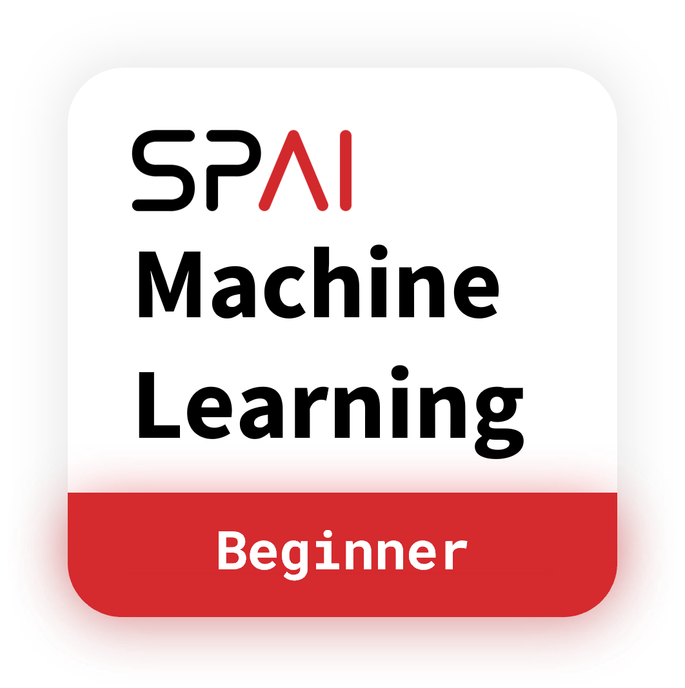

# SPAI's Beginner Machine Learning Bootcamp 2021

SPAI's Beginner Machine Learning Bootcamp is a 4-Day virtual bootcamp hosted by SPAI's Operation Department, aimed to promote the use of Data Science and AI amongst SP Students.
The bootcamp's curriculum is designed for participants without prior-programming knowledge to get them familiar with basics Python programming and perform Supervised Learning with classic ML Models using Scikit-Learn.

## Bootcamp Curriculum
<table>
    <tr>
        <th>Day</th>
        <th>Lesson Content</th>
        <th>Resources</th>
    <tr>
    <tr>
        <td>Day 0 : Basic Python Programming</td>
        <td>
            <ul>
                <li>Python & Notebook Environments</li>
                <li>Variables</li>
                <li>Printing & Comments</li>
                <li>Python Operators</li>
                <li>Data Types</li>
                <li>Conditional Statements</li>
                <li>Loops</li>
                <li>Functions and Inputs</li>
                <li>Libraries</li>
            </ul>
        </td>
        <td>
            <ul>
                <li><a href="https://github.com/Tien-Cheng/ML-Bootcamp-2021/tree/main/Beginner%20Machine%20Learning%20Bootcamp/Day%200_Basic%20Python%20Programming/SPAI%20ML%20Bootcamp%20-%20Day%200.pdf">Slides</a></li>
                <li><a href="https://github.com/Tien-Cheng/ML-Bootcamp-2021/tree/main/Beginner%20Machine%20Learning%20Bootcamp/Day%200_Basic%20Python%20Programming/Day%200%20Tutorial%20(Participant).ipynb">Tutorial Notebook</a></li>
                <li><a href="https://github.com/Tien-Cheng/ML-Bootcamp-2021/tree/main/Beginner%20Machine%20Learning%20Bootcamp/Day%200_Basic%20Python%20Programming/Day%200%20Practical%20(Participant).ipynb">Practical Notebook</a></li>
                <li><a href="https://github.com/Tien-Cheng/ML-Bootcamp-2021/tree/main/Beginner%20Machine%20Learning%20Bootcamp/Day%200_Basic%20Python%20Programming/Instructor's%20Copy">Instructor's Notebook</a></li>
            </ul>
        </td>
    <tr>
        <td>Day 1 : Exploratory Data Analysis</td>
        <td>
            <ul>
                <li>Introduction to Data Science & Machine Learning</li>
                <li>Exploratory Data Analysis</li>
                <li>Pandas</li>
                <li>Type of Features</li>
                <li>Statistical Primer</li>
                <li>Pandas-Profiling</li>
            </ul>
        </td>
        <td>
            <ul>
                <li><a href="https://github.com/Tien-Cheng/ML-Bootcamp-2021/tree/main/Beginner%20Machine%20Learning%20Bootcamp/Day%201_Exploratory%20Data%20Analysis/SPAI%20ML%20Bootcamp%20-%20Day%201.pdf">Slides</a></li>
                <li><a href="https://github.com/Tien-Cheng/ML-Bootcamp-2021/tree/main/Beginner%20Machine%20Learning%20Bootcamp/Day%201_Exploratory%20Data%20Analysis/Day%201%20Tutorial%20(Participant).ipynb">Tutorial Notebook</a></li>
                <li><a href="https://github.com/Tien-Cheng/ML-Bootcamp-2021/tree/main/Beginner%20Machine%20Learning%20Bootcamp/Day%201_Exploratory%20Data%20Analysis/Day%201%20Practical%20(Participant).ipynb">Practical Notebook</a></li>
                <li><a href="https://github.com/Tien-Cheng/ML-Bootcamp-2021/tree/main/Beginner%20Machine%20Learning%20Bootcamp/Day%201_Exploratory%20Data%20Analysis/Instructor's%20Copy">Instructor's Notebook</a></li>
            </ul>
        </td>
    </tr>
    <tr>
        <td>Day 2 : Data Pre-Processing</td>
        <td>
            <ul>
                <li>Types of ML Algorithms</li>
                <li>Missing Data</li>
                <li>Feature Scaling</li>
                <li>Outliers</li>
                <li>Ordinal Encoding</li>
                <li>One-Hot Encoding</li>
            </ul>
        </td>
        <td>
            <ul>
                <li><a href="https://github.com/Tien-Cheng/ML-Bootcamp-2021/tree/main/Beginner%20Machine%20Learning%20Bootcamp/Day%202_Data%20Pre-Processing/SPAI%20ML%20Bootcamp%20-%20Day%202.pdf">Slides</a></li>
                <li><a href="https://github.com/Tien-Cheng/ML-Bootcamp-2021/tree/main/Beginner%20Machine%20Learning%20Bootcamp/Day%202_Data%20Pre-Processing/Day%202%20Tutorial%20(Participant).ipynb">Tutorial Notebook</a></li>
                <li><a href="https://github.com/Tien-Cheng/ML-Bootcamp-2021/tree/main/Beginner%20Machine%20Learning%20Bootcamp/Day%202_Data%20Pre-Processing/Day%202%20Practical%20(Participant).ipynb">Practical Notebook</a></li>
                <li><a href="https://github.com/Tien-Cheng/ML-Bootcamp-2021/tree/main/Beginner%20Machine%20Learning%20Bootcamp/Day%202_Data%20Pre-Processing/Instructor's%20Copy">Instructor's Notebook</a></li>
            </ul>
        </td>
    </tr>
    <tr>
        <td>Day 3 : Hands-On Machine Learning</td>
        <td>
            <ul>
                <li>Introduction to ML Probles and Models</li>
                <li>Classification Model</li>
                <li>Regression Model</li>
                <li>Overfitting vs Underfitting</li>
                <li>Model Building and Evaluation</li>
            </ul>
        </td>
        <td>
            <ul>
                <li><a href="https://github.com/Tien-Cheng/ML-Bootcamp-2021/tree/main/Beginner%20Machine%20Learning%20Bootcamp/Day%203_Hands-On%20Machine%20Learning/SPAI%20ML%20Bootcamp%20-%20Day%203.pdf">Slides</a></li>
                <li><a href="https://github.com/Tien-Cheng/ML-Bootcamp-2021/tree/main/Beginner%20Machine%20Learning%20Bootcamp/Day%203_Hands-On%20Machine%20Learning/Day%203%20Tutorial%20(Participant).ipynb">Tutorial Notebook</a></li>
                <li><a href="https://github.com/Tien-Cheng/ML-Bootcamp-2021/tree/main/Beginner%20Machine%20Learning%20Bootcamp/Day%203_Hands-On%20Machine%20Learning/Day%203%20Practical%20(Participant).ipynb">Practical Notebook</a></li>
                <li><a href="https://github.com/Tien-Cheng/ML-Bootcamp-2021/tree/main/Beginner%20Machine%20Learning%20Bootcamp/Day%203_Hands-On%20Machine%20Learning/Instructor's%20Copy">Instructor's Notebook</a></li>
            </ul>
        </td>
    <tr>
</table>

## Contact Us
 
